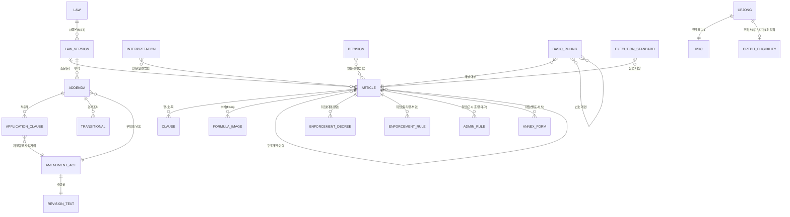
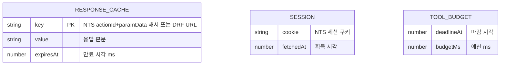
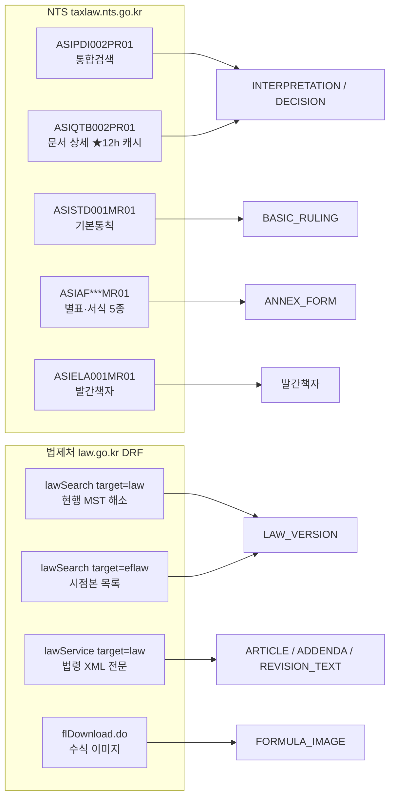

# ERD — taxlaw-nts-mcp 데이터 모델

> **문서 성격** 내부 참조용(작성자 + LLM 에이전트). 미검증 영역·기술부채를 감추지 않고 ⚠로 표기한다.
> **대상 버전** v0.27.2 · **최종 갱신** 2026-08-07 · **라이브 검증** 2026-08-07
> **관련 문서** [PRD.md](./PRD.md) · [WORKFLOW.md](./WORKFLOW.md) · [tools.md](./tools.md)

---

## 0. 왜 이 프로젝트에 ERD가 필요한가

**이 프로젝트에는 관계형 DB가 없다.** 실체는 NTS·법제처 API 프록시 + 로컬 JSON 룩업 3종이다.
그럼에도 ERD를 두는 이유는 이렇다 — **이 MCP에서 발생한 심각 버그의 대부분이 "엔티티 간 관계 오귀속"이었다.**

| 실제 발생 사고 | 오귀속된 관계 |
|---|---|
| 정의목적 타법 인용(`「소득세법」에 따른 …제95조 준용`)이 자기법 조문을 타법으로 귀속 → 무경고 데이터 승격 | `ARTICLE ─[준용]→ ARTICLE` 의 **법령 소속** |
| 조특법 §30 고시 §3②2호 누락 → 결론 반전 | `ARTICLE ─[위임]→ ADMIN_RULE` 미하강 |
| 해석례 본문의 "기본통칙 N-N"이 옛 번호 | `BASIC_RULING ─[번호개편]→ BASIC_RULING` |
| 구 §35 인용을 현행으로 오인 | `ARTICLE ─[구조개편]→ ARTICLE` |
| 부칙 적용례의 "개정규정" 사정거리 오판 | `ADDENDA ─[사정거리]→ AMENDMENT_ACT` |

즉 **관계 모델이 곧 정확성 사양(correctness spec)** 이다. 데이터가 어디 저장되느냐보다, 무엇이 무엇을 가리키느냐가 이 제품의 본질이다.

문서는 3층이다.

| 파트 | 내용 | 실체 |
|---|---|---|
| **1** | 법령 도메인 개념 모델 | 코드에 테이블로 존재하지 않음. MCP가 **항해하는 대상**의 구조 |
| **2** | 물리 저장소 | 코드에 실제 존재하는 것 (JSON 3종 + 런타임 상태 + 로그) |
| **3** | 식별자 카탈로그 · 외부 소스 매핑 | 파트1 ↔ 파트2를 잇는 키 체계 |

---

# 파트 1 — 법령 도메인 개념 모델

## 1.1 전체 관계도



## 1.2 엔티티 정의

### 규범 계층 (normative)

| 엔티티 | 한국어 | 식별자 | 회수 도구 | 비고 |
|---|---|---|---|---|
| `LAW` | 법령 | 법령명 | `get_law_article(lawName=)` | 법률·시행령·시행규칙 각각이 별개 LAW |
| `LAW_VERSION` | 시행본 | **MST** | DRF `eflaw` 목록 | (MST × 시행일) 쌍. 동일 시행일에 복수 공포본 존재 가능 ⚠ |
| `ARTICLE` | 조문 | `jo` (제N조의M) | `get_law_article` | 본문 텍스트 + 개정 꼬리표 |
| `CLAUSE` | 항·호·목 | ①②③ / 제N호 / 가나다목 | 조문 본문 내 파싱 | 독립 엔티티로 저장하지 않음 |
| `ADDENDA` | 부칙 | 공포번호 | `get_law_addenda` | **NTS DB에 없음 → 법제처 DRF 전용** |
| `AMENDMENT_ACT` | 개정령 | 공포번호·공포일 | `get_law_revision_text` | |
| `REVISION_TEXT` | 개정문 | 공포번호 | `get_law_revision_text` | "…를 …로 한다" 지시문 원문 |
| `APPLICATION_CLAUSE` | 적용례 | 부칙 조번호 | `trace_article_application` | |
| `TRANSITIONAL` | 경과조치 | 부칙 조번호 | `trace_article_application` | |
| `ENFORCEMENT_DECREE` | 시행령 | — | `get_law_article` | 별개 LAW로 취급 |
| `ENFORCEMENT_RULE` | 시행규칙 | — | `get_law_article` | |
| `ADMIN_RULE` | 행정규칙(고시·훈령·예규) | 문서번호 | **korean-law-mcp 전용** | NTS 컬렉션 stale ⚠ |
| `ANNEX_FORM` | 별표·서식 | 서식ID | `search_taxlaw_forms` | 5종(annex/legal/instruction/favorite/all) |
| `FORMULA_IMAGE` | 계산식 이미지 | `flSeq` | DRF `flDownload.do` | ★ 본문 텍스트에 안 나옴 |

### 해석 계층 (interpretive — 법규성 없음)

| 엔티티 | 한국어 | 식별자 | 회수 도구 | 규범력 |
|---|---|---|---|---|
| `INTERPRETATION` | 세법해석례 | `ntstDcmId` (dcmClCd 01~04) | `search_taxlaw_documents(docType=interpretations)` | 행정해석 |
| `DECISION` | 판례·결정례 | `ntstDcmId` (dcmClCd 05~10) | `search_taxlaw_documents(docType=disputes)` | 09 판례·10 헌재만 사법 |
| `BASIC_RULING` | 기본통칙 | 법령 + 번호 | `get_taxlaw_basic_ruling_text` | 내부 지침 |
| `EXECUTION_STANDARD` | 세법집행기준 | `24-21-1` 형식 | `call_taxlaw_extra(get_execution_standard)` | 내부 지침, 15개 법령 |
| `HOMETAX_COUNSEL` | 홈택스 상담사례 | `reqStdId` | `call_taxlaw_extra(get_taxlaw_hometax_counsel_text)` | 참고 |

### 분류 계층 (classification)

| 엔티티 | 식별자 | 카디널리티 | 소스 |
|---|---|---|---|
| `UPJONG` | 업종코드 5자리 | 1,784 | `upjong-ksic.json` |
| `KSIC` | 표준산업분류 4~5자리 | 1,784 (1:1 대응) | 동일 |
| `CREDIT_ELIGIBILITY` | 업종코드 5자리 | 1,611 | `credit-eligibility.json` ⚠ provisional |
| `RESTRUCTURE` | 법령명 + 옛 조번호 | 법령별 매핑 사전 | `statute-restructures.json` |

## 1.3 관계 의미론 — 정확성 위험 지도

**이 표가 이 문서의 핵심이다.** 각 관계마다 ①무엇을 뜻하는가 ②어느 코드가 다루는가 ③무엇을 틀리기 쉬운가.

### R1. `ARTICLE ─[준용]→ ARTICLE`

- **의미** 한 조문이 다른 조문의 규율을 끌어다 쓴다. 준용 대상은 **자기법**일 수도 **타법**일 수도 있다.
- **코드** `extractJunyongTargets(articleText, selfJo)` → `JunyongTarget{ jo, hang, lawName, annex, lawHint, joRange, capped }` · 렌더 `fmtJunyong()` · 글자수 상한 `capJunyongBlocks()` · 타법 해소 `resolveCrossLawCtx()`(v0.27.1 prewarm 병렬)
  - v0.27.0 — 연결사(`,·ㆍ및·와·과·또는` + `「법령명」`) 열거를 **전건 추출**(종전엔 마지막 1건만 남고 나머지 무경고 소실). 개수 상한 `JUNYONG_TARGET_CAP`=6 도달 시 `capped` 라벨.
  - v0.27.1 — 앵커 컨텍스트 창 **40 → 120자**(창 밖 「법령명」이 `lawHint`조차 못 남기던 것 수정).
- **판정 규칙(EF-3 인접성 게이트, v0.25.0 P0)**
  `」` 와 조문 참조 사이의 개재 문자가 **조문참조 연쇄·연결사만**(`제N조`/`같은법`/`및`/`부터`/`까지`/`·`/`ㆍ`/`,`)이면 → 그 법 귀속.
  **산문이 끼어 있으면 rejected** → 자기법으로 처리하고 `lawHint`에 모호 라벨만 남긴다.
- **⚠ 함정**
  - 정의목적 인용(`「소득세법」에 따른 근로소득 … 제95조를 준용한다`)에서 §95는 **자기법** 조문이다. 인접성 게이트가 없던 v0.24.0까지 이걸 소득세법 §95로 오귀속하고 **경고 없이** 데이터로 승격했다.
  - **2층 타임라인** — 준용하는 조문과 준용 대상 조문은 **각자 다른 부칙**으로 적용시기가 정해진다. 한쪽만 보면 틀린다.
  - **조-범위 준용**(`제14조부터 제54조까지 준용`) — 대표 조 1건만 2층 추적하고 `joRange`로 범위를 명시한다. 전개하지 않는다.

### R2. `ARTICLE ─[위임]→ ENFORCEMENT_RULE | ADMIN_RULE`

- **의미** 조문이 운영 세부(적용시점·판정단위·계산방법)를 하위규범에 넘긴다.
- **코드** `buildDelegationGuard(body, jo)` — 정규식 2종
  - `toGosi` 고시 위임: `정하여 고시` / `고시로 정한다·하는·하도록·하여` / `(장관|청장)이 (정|고시)…` / `위원회가 …`
  - `toRule` 부령 위임: `(총리령|○○부령)(으로|에|이) 정한다·하는·하도록·하여`
- **과발동 억제 2종**
  - 무주체 `고시한다`는 **제외**(주체 anchor 필수)
  - `대통령령`은 **제외** — 시행령 확인은 기본 동작이라 경고 가치가 없음
  - 부령 위임 직후 24자 내가 **서식류 명사뿐**(서식·신청서·신고서·계산서·명세서·증명서·서류)이면 **강등** (공리⑥: 서식·별지 < 법령 문언)
- **⚠ 함정** 이 신호는 **`get_law_article`에만 부착된다.** 조문 본문을 korean-law `get_law_text`로 읽으면 이 신호가 **없다** → 위임 하강 판단이 필요하면 본 MCP를 1콜 병행해야 한다.

### R3. `LAW_VERSION ─[개정]→ LAW_VERSION`

- **의미** 같은 조문의 시점별 본문. 어느 시점본을 봤느냐가 결론을 바꾼다.
- **코드** `buildLaterRevisionGuard()` → `── 후행 개정 확인 ──` 블록 · 대조 `findArticleInXml()` + `normalizeArticleForCompare()` · 차분 `diffArticleTexts()` (`substantive`/`cosmetic`/`renumbering` 3분류)
- **⚠ 함정**
  - `eflaw` 목록은 (MST × 시행일) 행을 **옛 공포본까지 보존**한다. 시행일별로 **최신 공포본만** 채택하지 않으면 건수 과대 + 구버전 텍스트 유도.
  - 시점본 조회 결과는 **"그 시점에 시행 중이던 조문"** 일 뿐, **어느 과세연도 신고에 적용되는지는 별개 판정**(→ R4).

### R4. `APPLICATION_CLAUSE ─[사정거리]→ AMENDMENT_ACT`

- **의미** 부칙 적용례의 "**○○ 개정규정**"은 **그 개정령이 실제 바꾼 문구 단위**만 가리킨다. 조문 전체가 아니다.
- **코드** `checkAmendmentBinding(promulgationDate, inventoryDates)` → `개정함` / `개정 흔적 없음` / `판정불가` · 인벤토리는 현행본 개정 꼬리표(`<개정 2026.5.22>`)에서 수집
- **해석 공리 6개** (INSTRUCTIONS 및 `buildApplicationTimingGuard()`)
  1. 신구 문구를 나란히 대조 — 단일 시점본으로 단정 금지
  2. "개정규정" = 그 개정령이 실제 바꾼 문구 단위만
  3. 경과조치는 **자기 개정령만** 사정거리
  4. 후행·특정 적용례 > 일반 경과조치
  5. 적극 문언 우선 — fallback 창작 금지
  6. 서식·별지 < 부칙·법령 문언
- **⚠ 함정** **부칙-of-부칙** — 개정령이 다른 개정령의 부칙을 개정하면, 통합본 부칙에는 `<개정 2026.5.22>` 꼬리표만 남고 **지시문 원문은 개정문에만 있다**. `[부칙개정⚠]` 플래그가 뜨면 `get_law_revision_text`로 원문 대조 필수.

### R5. `INTERPRETATION | DECISION ─[인용]→ ARTICLE`

- **의미** 해석례가 어느 시점의 조문을 근거로 삼았는가. **구법 기반 해석례는 사문화 가능**.
- **코드** `extractRelatedSection()` → `extractCitations()` → `checkYearApplicability()` **8단계 분류**:
  `valid_current` / `before_target` / `partially_outdated` / `repealed_or_superseded` / `target_or_later` / `target_or_later_inferred` / `citations_no_dates` / `no_citations` / `no_target` / `uncertain`
- **종합 채점** `assessDoctrineValidity()` → `FinalValidity` + `NextAction[]`(`required`/`recommended`/`optional` 우선순위)
- **⚠ 함정** 본문에 "관련규정" 헤더가 없으면 메타데이터 `관련법령` 목록으로 fallback한다. fallback 경로는 조 번호 hint가 있어야 인정.

### R6. `ARTICLE ─[구조개편]→ ARTICLE`

- **의미** 전부개정으로 조 번호가 이동. 옛 위치 인용을 현행 위치로 매핑.
- **코드** `lookupRestructure(lawName, articleRef)` · `detectPreRestructureCitations()` → `assess_doctrine_validity`에서 **사문화 점수 자동 격상**
- **데이터** `statute-restructures.json` — `laws[법령명].restructures[].mappings["법.제6조" → "법.제8조"]`
- **⚠ 원칙** 파일 주석에 명시 — **"검증된 매핑만 포함. 잘못된 매핑이 환각보다 위험."**

### R7. `BASIC_RULING ─[번호개편]→ BASIC_RULING`

- **의미** 해석례 본문에 등장하는 "기본통칙 N-N"은 **옛 번호**일 수 있다.
- **절차** `list_taxlaw_basic_ruling_laws` → `get_taxlaw_basic_ruling_text`로 **인접 번호대 수집** → 현행 번호 확인
- **⚠ 원칙** 미확인이면 "현행 번호 미확인" ⚠ 부착. 통칙 도구가 NOT_FOUND면 **통칙 인용 자체를 제거**한다.

### R8. `UPJONG ─[1:1]→ KSIC ─[적격]→ CREDIT_ELIGIBILITY`

- **의미** 업종코드 → KSIC 5단계(대/중/소/세/세세) → 조특법 §6③(창업중소기업) 호 / §7①1호(중소기업특별) 호·목
- **코드** `findByUpjong` / `findByKsic` / `findByKsicPrefix` / `resolveClassName` / `classifyIndustryForArticle` / `classifyCreditEligibility`
- **레벨 추론** 법조문에 등장하는 분류명이 5단계 중 어느 레벨과 일치하는지 정규화 비교(띄어쓰기·괄호·중복공백 무시)로 자동 판정
- **⚠ 중대** `credit-eligibility.json`은 `"provisional": true` — 파일 자체 `note`에 **"연계표 충실 전사값(미검증) … 연계표 정확도 재검토 진행 중"** 이라 적혀 있다. 단서업종(자동차정비공장=종합·소형종합정비업만, 의료업 요건, 부동산임대·소비성서비스 제외)은 **조특법·조특령·조특칙으로 별도 확인 필요**. 이 데이터를 단독 근거로 결론 내지 말 것.

---

# 파트 2 — 물리 저장소

## 2.1 정적 데이터 (`src/data/` → 빌드 시 `build/data/`로 복사)

빌드 파이프라인: `scripts/build-upjong-db.mjs` (생성) · `scripts/copy-data.mjs` (복사)

### `upjong-ksic.json` — 1,784행

```jsonc
{
  "generatedAt": "2026-05-14T12:49:05.301Z",
  "source": "NTS 홈택스 「업종코드-표준산업분류 연계표」 (공개 자료)",
  "year": 2024,
  "count": 1784,
  "records": [{
    "seq": 1,
    "upjong": "11000",                    // PK — 업종코드 5자리
    "up":   { "l1Code": "A", "l1Name": "농업, 임업 및 어업",
              "l2Code": "1", "l2Name": "농업",
              "l3Code": "11", "l3Name": "작물 재배업",
              "l4Code": "110", "l4Name": "곡물 및 기타 식량작물 재배업",
              "l5Name": "곡물 및 기타 식량작물 재배업" },
    "ksic": { "code": "1110", /* + 동일한 l1~l5 구조 */ },
    "note": null
  }]
}
```

- `up`(국세청 분류)과 `ksic`(통계청 분류)는 **대칭 구조**(`ClassPath` 인터페이스 공유), `ksic`만 `code` 필드 추가
- **레벨 코드는 없고 이름만 있는 칸이 존재** — `l5Code`는 스키마에 아예 없다(`l5Name`만)

### `credit-eligibility.json` — 1,611행 ⚠ provisional

```jsonc
{
  "provisional": true,                    // ⚠ 미검증 선언
  "source": "창중감,중특감 판정기.xlsx [연계표] (사용자 작성 — SSOT)",
  "note": "연계표 충실 전사값(미검증) … 연계표 정확도 재검토 진행 중.",
  "records": {
    "101000": {                           // PK — 업종코드 5자리
      "chojunggam":  { "eligible": true, "ho": ["1"],  "note": null },  // 조특 §6③ 창업중소기업
      "jungteukgam": { "eligible": true, "ho": ["라"], "note": null }   // 조특 §7①1호 중소기업특별
    }
  }
}
```

- **SSOT는 이 JSON이 아니라 원본 xlsx** — 수정은 xlsx에서 하고 재빌드
- `ho`가 비어 있으면 **비적격**

### `statute-restructures.json`

```jsonc
{
  "version": "2026.05.19",
  "_doc": "세법 전부개정·구조개편 이력 사전 … 검증된 매핑만 포함 — 잘못된 매핑이 환각보다 위험.",
  "laws": {
    "부가가치세법": {
      "restructures": [{
        "date": "2013-07-01", "type": "전부개정",
        "law_number": "법률 제11873호", "promulgated": "2013-06-07",
        "note": "현행 부가세법 체계로 전부개정 …",
        "mappings": {                     // 옛 위치 → 현행 위치
          "법.제12조": "법.제26조",
          "법.제12조제1항제13호": "법.제26조제1항제15호",
          "시행령.제35조제1호가목": "시행령.제42조제1호가목"
        }
      }]
    }
  }
}
```

- 키 형식 `{법|시행령|시행규칙}.제N조[제M항][제K호][가목]` — **항·호·목 수준까지 매핑**

## 2.2 런타임 상태 (프로세스 메모리 — 재시작 시 소멸)



### `responseCache` — LRU + TTL

| 항목 | 값 | 근거 |
|---|---|---|
| 최대 엔트리 | `CACHE_MAX_ENTRIES` = 200 | |
| 최대 총 문자 | `CACHE_MAX_TOTAL_CHARS` = 64,000,000 | |
| 최대 단건 문자 | `CACHE_MAX_ENTRY_CHARS` = 8,000,000 | 초과 시 **캐시하지 않음** |
| TTL — 법제처 XML | `MOLEG_CACHE_TTL_MS` = **24h** | 법령 XML은 사실상 불변 |
| TTL — NTS 문서 상세 | `NTS_DETAIL_CACHE_TTL_MS` = **12h** | `NTS_DETAIL_ACTION_IDS = {ASIQTB002PR01}` |
| TTL — NTS 기타(검색) | `NTS_DEFAULT_CACHE_TTL_MS` = **1h** | 신규 문서 유입 여지 |

- **성공 응답만 캐시** — 쿠키 갱신·재시도 경로와 충돌 없음
- LRU 갱신은 `delete` 후 `set` 재삽입 방식
- `lawName → MST` 해소도 `lawSearch` URL 캐시로 함께 커버됨

### `cachedSession`

- `SESSION_TTL_MS` = **5분**. `fetchTaxlawSession(refererPath, force?)`
- NTS는 무인증이지만 **세션 쿠키 없이는 actionId POST가 거부**된다
- `getSetCookieHeaders()` — `Headers.getSetCookie()` 우선, 미지원 런타임은 단일 `set-cookie` fallback

### `toolBudgetStore` (AsyncLocalStorage)

- `TAXLAW_TOOL_BUDGET_MS` 기본 **90,000ms**. `0` 이하 = 무제한(store 없이 실행)
- 초과 시 `[BUDGET_EXCEEDED]` — **부분 결과는 유효**, 재호출 권장
- 백오프 재시도 전에도 잔여 예산을 확인해 초과 예상이면 중단

## 2.3 영속 로그

### 인용 검증 원장 (JSONL, append-only)

| 항목 | 값 |
|---|---|
| 경로 | `$TAXLAW_CITATION_LEDGER` 또는 기본 `~/.taxlaw-nts-citation-ledger.jsonl` |
| 쓰기 | `appendCitationLedger(entry)` — `{...entry, ts: ISO8601}` |
| 실패 처리 | **무시**(가용성 우선) — 원장 기록 실패가 검증을 막지 않는다 |
| 용도 | 빌드·마감 게이트가 **"검증을 실제로 돌렸는가"** 를 대조하는 근거 |

## 2.4 환경 변수

| 변수 | 기본값 | 용도 |
|---|---|---|
| `LAW_GO_KR_OC` | — | **법제처 DRF 인증키(필수)**. 없으면 시점·부칙 도구 전부 `INVALID_PARAMETER` |
| `TAXLAW_TOOL_BUDGET_MS` | 90000 | 도구 시간예산. 0 이하 = 무제한 |
| `TAXLAW_EXPOSE_ALL` | — | `1`이면 은닉 도구 15종을 `tools/list`에 전부 노출 |
| `TAXLAW_CITATION_LEDGER` | `~/.taxlaw-nts-citation-ledger.jsonl` | 원장 경로 |
| `TAXLAW_USER_AGENT` | `taxlaw-nts-mcp/{VERSION} (+GitHub URL)` | UA 재정의 |
| `TAXLAW_RECENT_THRESHOLD_YEARS` | 3 | `target_or_later_inferred` 판정 임계 연수 |
| `TAXLAW_MCP_TEST_MODE` | — | 테스트 모드 |

## 2.5 보안 — OC 키 누출 방어

`redactSecrets(text)` — 모든 도구 출력에 적용. `[?&](oc|%4f%43)=` 를 `***`로 마스킹(대소문자·URL인코딩 변형 포함).

> ⚠ **코드 주석의 정정 이력** v0.15.0은 이를 "장식적 방어심층"으로 기술했으나 **사실이 아니었다**. DRF fetch URL(OC 포함)이 여러 도구의 `출처: ${url}` 라인에 그대로 실려 왔고 `redactSecrets`가 **실질 방어선**이었다. v0.21.0(#G11)에서 표시용 URL을 `displayLawServiceUrl`(OC 배제)로 분리하고, `redactSecrets`는 에러·미래 경로용 최후 방어선으로 존치.

---

# 파트 3 — 식별자 카탈로그 · 외부 소스 매핑

## 3.1 식별자 카탈로그

| 식별자 | 형식 | 소속 | 발급처 | 획득 경로 |
|---|---|---|---|---|
| `MST` | 숫자 | `LAW_VERSION` | 법제처 | DRF `lawSearch(target=eflaw)` · korean-law `search_law` |
| `ntstDcmId` | 문자열 | `INTERPRETATION`·`DECISION` | NTS | `search_taxlaw_documents` 결과 |
| `dcmClCd` | `01`~`10` | 문서 종류 | NTS | 아래 3.2 |
| `taxLawCode` | `303`~`354` | 세목 분류 | NTS | 아래 3.3 |
| `jo` | `제N조` / `제N조의M` | `ARTICLE` | — | 사용자 입력 |
| `flSeq` | 숫자 | `FORMULA_IMAGE` | 법제처 | 조문 XML의 `` |
| `actionId` | `ASI***PR01` 등 | NTS 액션 | NTS | `SITE_MENU_ACTIONS` 정적 목록 |
| 업종코드 | 5자리 숫자 | `UPJONG` | 국세청 | `upjong-ksic.json` |
| KSIC 코드 | 4~5자리 숫자 | `KSIC` | 통계청 | 동일 |

## 3.2 `dcmClCd` — 문서 종류 코드

| 코드 | 라벨 | 군 | 상세 경로 |
|---|---|---|---|
| `01` | 사전답변 | **해석례군** `QUESTION_CODES` | `/qt/USEQTA002P.do` |
| `02` | 질의회신 | 해석례군 | `/qt` |
| `03` | 과세기준자문 | 해석례군 | `/qt` |
| `04` | 고시서면질의 | 해석례군 | `/qt` |
| `05` | 과세전적부심사 | **판례군** `PRECEDENT_CODES` | `/pd/USEPDA002P.do` |
| `06` | 이의신청 | 판례군 | `/pd` |
| `07` | 심사청구 | 판례군 | `/pd` |
| `08` | 심판청구 | 판례군 | `/pd` |
| `09` | 판례 | 판례군 | `/pd` |
| `10` | 헌법재판소 | 판례군 | `/pd` |

**별칭 매핑** `DOC_TYPE_CODES` — `all`=01~10 · `interpretations`/`interpretation`=01~04 · `disputes`/`decisions`=05~10 · `advance`=01 · `reply`=02 · `tax_standard`=03 · `written`=04 · `tax_pre_review`/`pre_assessment`=05 · `objection`=06 · `review`=07 · `tribunal`=08 · `precedent`=09 · `constitutional`=10

> **성능 최적화 근거** 코드를 알면 상세 경로를 먼저 시도해 헛왕복을 제거한다 — 판례군(05~10)은 `/pd` 우선, 해석례군(01~04)은 `/qt` 우선, 1차 미스 시 나머지 폴백 (`fetchRelatedLawsForCitation`, v0.21.0 #W-6).

## 3.3 `taxLawCode` — 세목 분류 (`TAX_LAW_CODE_MAP`)

라이브 검증으로 확정된 매핑. **v0.9.4~v0.9.5의 schema 안내가 틀렸던 항목이 많아** 각 엔트리에 정정 이력이 `hint`로 박혀 있다.

| 코드 | NTS 라벨 | 포함 세목 | 정정 이력 |
|---|---|---|---|
| `303` | 법인세 | 법인세 | |
| `305` | 종합소득세 | 종합소득세 **단독** | ⚠ 양도세는 별도 307 |
| `306` | 부가가치세 | 부가가치세 | ⚠ v0.9.5까지 "313 묶음"으로 오안내 |
| `307` | 양도소득세 | 양도소득세 | ⚠ v0.9.5까지 "305 묶음"으로 오안내 |
| `308` | 상속증여세 | 상속세·증여세 | |
| `309` | 조세특례 | 조세특례제한법 | **조특 검색은 309** |
| `310` | 국제조세 | 국제조세조정·외국법인·비거주자·조세조약 | |
| `311` | 종합부동산세 | 종합부동산세 | ⚠ v0.9.4까지 "상속증여세"로 오표기 |
| `312` | 원천세 | 원천세 | ⚠ 직접 호출 시 NOT_FOUND 빈번 — 305 호출 시 mismatch로 노출됨(NTS 인덱싱 quirk) |
| `313` | 소비세 | 개별소비세·주세·인지세 | ⚠ 부가세는 별도 306 |
| `354` | 조세특례제한법 | — | ⚠ **deprecated** — 라이브 0건. legacy 호환용으로만 보존 |

## 3.4 외부 소스 ↔ 엔티티 매핑



### 통합검색 컬렉션 (`INTEGRATED_COLLECTIONS`)

`appendForm` · `statute` · `question` · `precedent` · `formerLibrary` · `hometaxCnslThan` (6종)

### 정렬 키

| 도구 | 맵 | 값 |
|---|---|---|
| 문서 검색 | `SORT_FIELD_MAP` | `date_desc`=`DCM_RGT_DTM/DESC` · `date_asc` · `reg_desc`=`FRS_RGT_DTM/DESC` · `reg_asc` |
| 통합 검색 | `INTEGRATED_SORT_MAP` | `score`=`SCORE/DESC` · `date_desc`=`DATE/DESC` |

### 사이트 메뉴 액션 (`SITE_MENU_ACTIONS`)

7개 섹션(법령 / 세법해석례 / 판례·결정례 / 별표·서식 / 전자도서관 / 고객센터 / 기타) 총 40여 항목. 각 항목은 `{ key, section, label, path, actionId?, defaultParamData?, highLevelTool?, note? }`.
`highLevelTool`이 있으면 **전용 고수준 도구를 쓰는 것이 정답**이고, 없는 항목만 `call_taxlaw_action` 폴백 대상이다.

## 3.5 두 DB의 수록범위 격차 (제품 존재 이유)

| 엔티티 | NTS | 법제처 | 본 MCP 전략 |
|---|---|---|---|
| `ADDENDA` 부칙 | ✗ **전용 컬렉션 없음** | ✓ | **DRF 전용 조회** |
| `FORMULA_IMAGE` 계산식 | — | ✓ (이미지) | DRF `flDownload` URL 반환 ★ |
| `INTERPRETATION` 해석례 | ✓ | ✗ | NTS 전용 |
| `BASIC_RULING` 기본통칙 | ✓ | ✗ | NTS 전용 |
| `EXECUTION_STANDARD` 집행기준 | ✓ | ✗ | NTS 전용 |
| `HOMETAX_COUNSEL` 상담사례 | ✓ | ✗ | NTS 전용 |
| `ADMIN_RULE` 행정규칙 | △ **stale** | ✓ | **korean-law 1차** (공포일·시행일·문서번호 3종 대조) |
| `ARTICLE` 현행 조문 | ✓ | ✓ | korean-law 1차 / **계산식 조문은 본 MCP 필수 동반** |
| `DECISION` 법원 판례 전문 | ✓ | ✓ | korean-law 1차 |

> **행정규칙 stale 실측** 「모범납세자 관리규정」— 법제처는 2026-05-19 제2742호 현행본, NTS는 2022-09-30 구버전 보유 → **조문 번호 전면 불일치**. 두 MCP는 자동 교차검증 관계가 아니라 **상호보완 DB**다.

---

## 부록 A — 모듈 ↔ 엔티티 책임 매트릭스

| 모듈 | LOC | 담당 엔티티·관계 |
|---|---:|---|
| `index.ts` | 6,175 | 전체 오케스트레이션 · 32개 도구 · 가드 9종 · fetch/cache/session |
| `upjong.ts` | 494 | `UPJONG` ↔ `KSIC` ↔ `CREDIT_ELIGIBILITY` (R8) |
| `year-check.ts` | 402 | `INTERPRETATION ─[인용]→ ARTICLE` 시점 판정 (R5) |
| `doctrine-assess.ts` | 591 | R5 종합 채점 + `NextAction` 큐 |
| `citation-extract.ts` | 242 | 본문 → `LawArticleRef` / `BasicRulingRef` 파싱 |
| `restructure-map.ts` | 180 | `ARTICLE ─[구조개편]→ ARTICLE` (R6) |
| `text-diff.ts` | 224 | `LAW_VERSION ─[개정]→ LAW_VERSION` 차분 (R3) — 의존성 0 독자 구현 |
| `tax-law-code-map.ts` | 174 | `taxLawCode` 매핑표 |
| `query-retry.ts` | 135 | NOT_FOUND 시 한국어 합성어 분해 재시도 |
| **합계** | **8,846** | |

## 부록 B — 미해결 · 기술부채

| 항목 | 내용 | 영향 |
|---|---|---|
| ⚠ `credit-eligibility.json` | `provisional: true`, 연계표 매핑 정확도 재검토 진행 중 | R8 결론을 단독 근거로 쓸 수 없음 |
| A3 시점맞춤 | 현행본 caveat은 붙였으나 시점 정합 미완 | 보류 |
| EF-1 | 보류 | |
| E4 | 보류 | |
| F-full | 보류 | |
| 국세징수법 2020 조번호 재편 | 배포 후 라이브검증 큐 | R6 매핑 미수록 가능 |
| `l5Code` 부재 | 스키마에 세세분류 코드 필드 없음(이름만) | 코드 기반 세세분류 조회 불가 |
