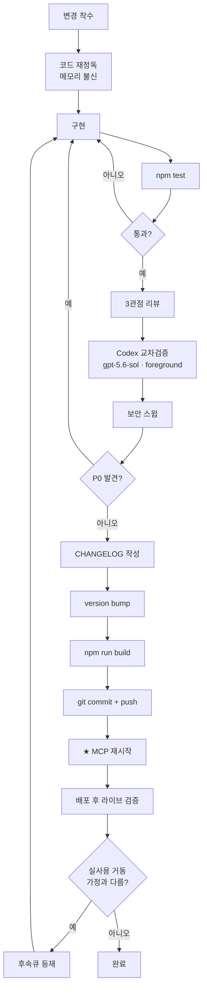

# RELEASE — 개발 · 리뷰 · 릴리스 워크플로

> **문서 성격** 내부 운영 절차. **파트 A·B**([WORKFLOW.md](./WORKFLOW.md))가 "이 MCP를 어떻게 쓰는가"라면 이 문서는 **"이 MCP를 어떻게 고치고 내보내는가"**다.
> **대상 버전** v0.27.2 · **최종 갱신** 2026-08-07 · **라이브 검증** 2026-08-07
> **관련 문서** [PRD.md](./PRD.md) · [ERD.md](./ERD.md) · [WORKFLOW.md](./WORKFLOW.md)

---

## 0. 전제 — 이 프로젝트의 변경이 위험한 이유

이 MCP의 출력은 **세무 실무 산출물의 근거**가 된다. 그래서 일반 코드베이스와 다른 두 가지 원칙이 있다.

| 원칙 | 의미 |
|---|---|
| **잘못된 데이터가 침묵보다 나쁘다** | 오귀속된 조문을 무경고로 제시하는 것은 NOT_FOUND보다 해롭다. 확신이 없으면 **강등(degrade)** 하지 창작하지 않는다 |
| **메모리를 믿지 말고 코드를 다시 읽어라** | 주석의 "확인됨"·"누출 경로 없음" 류 단정이 **이미 한 번 틀렸다**(v0.21.0 #G11). 이전 대화·메모리의 기억으로 패치하지 말 것 |

---

## 1. 전체 흐름



---

## 2. 착수 — 코드 재정독

**메모리·이전 대화의 기억으로 패치하지 않는다.** 착수 시 반드시:

1. 대상 함수를 **직접 Read** (grep 결과만 보고 고치지 말 것)
2. 그 함수를 호출하는 **모든 지점** 확인 — 특히 `trace_article_application` / `build_application_timetable` / `get_law_article` 3개는 같은 헬퍼를 공유한다
3. 해당 영역의 **CHANGELOG 이력** 확인 — 같은 곳을 이미 여러 번 고쳤을 가능성이 높다
4. 관련 **테스트 파일** 확인

> **왜** v0.24.0 → v0.25.0 → v0.26.0에서 `extractJunyongTargets` 하나를 **세 번 연속** 고쳤다. 매번 이전 수정의 가정이 실제 문형과 어긋나서다.

---

## 3. 구현 원칙

### 3.1 가드는 과발동보다 침묵이 낫다 — 단, 데이터 승격은 절대 금지

| 상황 | 원칙 |
|---|---|
| 정규식 가드(advisory) | 약간의 false positive 허용 |
| **데이터 귀속**(준용 대상·법령명·MST) | **false positive 절대 금지** — 확신 없으면 강등 + 라벨 |

**강등 패턴의 표준형**
```ts
// 확신 있으면 데이터로 승격, 아니면 힌트만
return adjacent ? { name: last[1] } : { rejected: last[1] }
//                                      ↑ lawHint로 렌더 — 사용자가 직접 확인
```

### 3.2 하위호환 shape 보존

반환 객체는 **값이 있는 필드만** 포함한다. 기존 소비자·테스트의 `deepEqual({jo, hang})`가 깨지지 않도록.

```ts
const t: JunyongTarget = {}
if (jo) t.jo = jo
if (hang) t.hang = hang
if (lawName) t.lawName = lawName   // 신규 필드는 있을 때만
```

### 3.3 리팩터 시 "회귀 0 설계"

공통 로직을 추출할 때는 **기존 경로가 바이트 동일**하게 나오는지 확인한다.
- 예: `articleInfoFromXml` 순수함수 추출 → self-law 경로 **바이트 동일** 확인 후 cross-law 경로 추가 (v0.25.0)
- 신규 파라미터는 **디폴트를 기존 동작으로** 두어 호출부 무변경 (`ctxUnits` 디폴트 = self units)

### 3.4 토큰 상한은 올리지 않는다

절단이 발생하면 **cap 상향이 아니라 생략 라벨 + 능동 재조회 안내**를 붙인다.

### 3.5 순수 함수는 export하고 테스트한다

네트워크와 무관한 판정 로직은 전부 `export` + 단위테스트 대상. 현재 이 패턴을 따르는 함수:
`buildLaterRevisionGuard` · `buildInterpretiveForkGuard` · `buildDelegationGuard` · `buildApplicationTimingGuard` · `extractJunyongTargets` · `fmtJunyong` · `capJunyongBlocks` · `checkAmendmentBinding` · `redactSecrets` · `decodeHtml`

---

## 4. 테스트

### 4.1 로컬

```bash
npm test          # pretest가 npm run build를 먼저 실행
```

**현재 기준선: 324건 / 324 통과 (14개 파일).** 실패 0이 아니면 진행 금지.

| 파일 | 대상 |
|---|---|
| `utils.test.js` | `decodeHtml`·`redactSecrets`·HTML/CDATA 파싱·ReDoS |
| `upjong.test.js` | 업종↔KSIC 매핑·레벨 추론 |
| `year-check.test.js` | 8단계 시점 분류 |
| `citation-extract.test.js` | 조문·통칙 참조 파싱 |
| `doctrine-assess.test.js` | 사문화 종합 채점 |
| `restructure-map.test.js` | 구조개편 매핑 |
| `admin-rule-stale.test.js` | 행정규칙 stale 라벨 |
| `timetable.test.js` | 적용시기·준용(EF-2/EF-3/TK-1) |
| `text-diff.test.js` | 신구 차분 3분류 |
| `meta.test.js` | 도구 메타·노출 정책 |
| `delegation-guard.test.js` | 위임 감지 정규식 |
| `exec-standard.test.js` | 세법집행기준 |
| `cross-law.test.js` | 준용 타법 해소 (fetch mock 통합경로 C1~C7) |
| `fetch-deadline.test.js` | fetch+body 단일 deadline (v0.27.2) — body 정지 시 abort 전달 |

### 4.2 CI (`.github/workflows/ci.yml`)

`main` push · PR 시 **6조합 매트릭스**:

| 축 | 값 |
|---|---|
| OS | ubuntu-latest / windows-latest / macos-latest |
| Node | 20.19.x / 22.x |

단계: `npm ci` → `npx tsc --noEmit` → `npm test` → `npm pack --dry-run`

### 4.3 통합 · 라이브 검증 스크립트

| 스크립트 | 용도 | 네트워크 |
|---|---|---|
| `scripts/smoke-test.mjs` | 빌드된 서버를 **STDIO로 spawn** 해 실제 도구 호출 | ✓ 라이브 NTS |
| `scripts/smoke-v0100.mjs` | v0.10.0 도구군 스모크 | ✓ |
| `scripts/self-review.mjs` | `fixtures/self-review/*.json` 사례로 사문화 채점 평가 | ✗ |
| `scripts/verify-timetable.mjs` | 타임테이블 검증 | ✓ |

> **fixture 스키마** `{ id, docNumber, productionDate, title, type, relatedLawsMeta, body, targetYear, expectedFinalValidity? }`

---

## 5. 리뷰 — 3관점 + Codex 교차

**단순 버그픽스가 아닌 변경(가드 신설·판정 로직·데이터 귀속)은 리뷰 필수.**

### 5.1 역할 분담

| 역할 | 담당 | 시점 |
|---|---|---|
| **구조 설계** | Fable | 착수 전 |
| **구현** | Opus | |
| **교차검증** | Codex `gpt-5.6-sol` (**foreground**) | 구현 후 |
| **최종 검토** | Fable | push 전 |

> Codex 모델명은 `gpt-5.6-sol`. `gpt-5.6`은 **400 거부**된다.

### 5.2 3관점 체크리스트

| 관점 | 묻는 것 |
|---|---|
| **정확성** | 이 변경이 **오귀속을 만들 수 있나?** 강등 경로가 있나? false positive가 데이터로 승격되나? |
| **회귀** | 기존 경로가 **바이트 동일**한가? shape 하위호환은? 다른 2개 도구(`trace`/`timetable`/`get_law_article`)에도 반영됐나? |
| **비용** | 토큰 순증인가 순감인가? 추가 왕복이 생겼나? 시간예산 안에 드나? |

### 5.3 보안 스윕

| 항목 | 확인 |
|---|---|
| **OC 누출** | 새로 추가한 `출처:` / 에러 메시지 URL에 OC가 실리지 않는가 → `displayLawServiceUrl` 사용했는가 |
| **ReDoS** | 새 정규식에 중첩 수량자(`(a+)+`)·무종결 태그 백트래킹 위험이 있는가 |
| **stdout 오염** | `console.log` 신규 사용이 없는가 (프로토콜 파괴) |

### 5.4 P0 판정 기준

아래에 해당하면 **릴리스 중단하고 즉시 수정**:

- 잘못된 법령·조문을 **경고 없이** 데이터로 제시
- 조문 부재·삭제를 **정상 결과로 둔갑**
- 계산식·후미 항·호가 **말없이** 소실
- OC 키가 출력에 노출
- 기존 정상 경로 회귀

---

## 6. CHANGELOG

`CHANGELOG.md` 최상단에 새 버전 블록. **이 프로젝트의 CHANGELOG는 릴리스 노트가 아니라 판단 근거 기록이다.**

### 6.1 필수 구성

```markdown
## [0.X.Y] - YYYY-MM-DD

한 줄 요약 — 무엇을 왜 (리뷰 주체 명시: "Fable 구조설계 + Opus 구현, N관점 리뷰")

### Fixed — <그룹명> (P0 여부)
- **ID(우선순위)**: 증상 → 원인 → 조치. ★ 실측 근거·재현 문형 포함
  - **버그**: 무엇이 어떻게 틀렸는가 (구체적 문형·법령 예시)
  - **조치**: 어떤 게이트·강등을 넣었는가

### Added
### Tests
- 신규 테스트 파일·케이스, 총 N→M

### 라이브 검증 결과(배포후 큐)
- 실제 MCP로 확인한 것

### 알려진 한계 / 보류(사유)
- 보류는 **반드시 사유와 함께**
```

### 6.2 작성 규칙

| 규칙 | 이유 |
|---|---|
| **실측 문형·법령 조문을 그대로 적는다** | "조특령 §100의16⑥ → 법인세법 §14~54" 같은 구체값이 있어야 재현·회귀 확인 가능 |
| **보류는 사유 필수** | "E4 보류(DRF 스키마 실측 필요)" — 사유 없는 보류는 잊힌다 |
| **테스트 총계 변화를 적는다** | `265→286` |
| **주석의 자기 정정도 기록** | v0.21.0 #G11처럼 과거 기술이 틀렸음을 발견하면 남긴다 |

---

## 7. 버전 · 빌드 · 배포

### 7.1 version bump — 3곳 동기화 ⚠

| 위치 | 값 |
|---|---|
| `package.json` `"version"` | `0.X.Y` |
| `src/index.ts` `const VERSION` | `"0.X.Y"` |
| `CHANGELOG.md` 최상단 헤딩 | `## [0.X.Y] - YYYY-MM-DD` |

> `VERSION`은 서버 메타(`{ name: "taxlaw-nts", version: VERSION }`)와 User-Agent에 쓰인다. **`package.json`만 올리면 런타임이 구버전을 보고한다.**

### 7.2 빌드

```bash
npm run build
# = tsc
#   + node scripts/copy-data.mjs      (src/data → build/data)
#   + chmod 755 build/index.js
```

`prepare` / `prepublishOnly` 훅에도 걸려 있어 설치·배포 시 자동 실행된다.

### 7.3 데이터 재빌드 (업종 DB 변경 시에만)

```bash
npm run build:data     # scripts/build-upjong-db.mjs → src/data/upjong-ksic.json
npm run build          # copy-data.mjs가 build/data로 복사
```

> **SSOT 주의** `credit-eligibility.json`의 원천은 **`창중감,중특감 판정기.xlsx`** 다. JSON을 직접 고치지 말고 xlsx를 고친 뒤 재생성한다. 현재 이 데이터는 `provisional: true` — [PRD.md §9.1 D1](./PRD.md) 참조.

### 7.4 커밋 · 푸시

```bash
git add -A
git commit -m "v0.X.Y: <한 줄 요약 — CHANGELOG 첫 줄과 동일>"
git push
```

커밋 메시지 관례(기존 이력): `v0.26.1: v0.26.0 배포 후 라이브 검증(실 MCP) 반영 — 저비용 확정 3건`

### 7.5 ★ MCP 재시작

> **재시작하지 않으면 신버전이 적용되지 않는다.** 빌드·푸시가 끝나도 실행 중인 MCP 서버 프로세스는 옛 `build/index.js`를 물고 있다.
> 클라이언트(Claude Code / Codex)를 재시작하거나 MCP 연결을 재설정할 것. **이 단계를 빠뜨린 채 "고쳤다"고 보고하지 말 것.**

### 7.6 npm 배포 (선택)

`files`: `build` · `docs` · `README.md` · `README-EN.md` · `CHANGELOG.md` · `LICENSE`
`npm pack --dry-run`으로 포함 내역 확인 후 publish.

---

## 8. 배포 후 라이브 검증

**빌드 통과 = 동작 확인이 아니다.** 이 프로젝트에서 발견된 P0의 상당수는 **배포 후 실제 MCP 호출**에서 나왔다.

### 8.1 절차

1. MCP 재시작 후 **실제 도구 호출**
2. 이번 변경이 겨냥한 **실제 법령 문형**으로 검증 (합성 fixture 아님)
3. 가정과 다른 거동 발견 → **CHANGELOG "라이브 검증 결과(배포후 큐)"에 기록**

### 8.2 검증 예 (실제 이력)

| 버전 | 라이브에서 발견한 것 |
|---|---|
| v0.26.1 | 조-범위 준용(`제14조부터 제54조까지`)에서 **마지막 조만 표시**되던 무언 누락 |
| v0.26.0 | EF-3 인접성 게이트가 실조문(조특령 §100의16⑥ → 「법인세법」)에서 정상 작동 확인 |
| v0.9.8 | `taxLawCode` 305/306/307/313 묶음 가정이 **응답 라벨과 어긋남** → 전면 재배치 |
| v0.9.8 | `taxLawCode=354` **라이브 0건** → deprecated |

### 8.3 후속큐 관리

라이브에서 발견했으나 이번에 안 고치는 것은 **사유와 함께** CHANGELOG 보류 절 + [PRD.md §9 백로그](./PRD.md)에 등재한다.

현재 후속큐: **A3 시점맞춤**(예산 충돌) · **EF-1**(cross depth2) · **E4**(DRF 스키마 실측 필요) · **F-full**(시각 Read가 상위호환) · **D1 연계표 정확도 재검토**

---

## 9. 릴리스 체크리스트

```
□ 대상 함수 직접 Read (메모리 아님)
□ 호출 지점 3개(trace/timetable/get_law_article) 반영 확인
□ 순수 함수는 export + 테스트 추가
□ npm test — 324건 이상 전부 통과
□ npx tsc --noEmit 통과
□ 3관점 리뷰 (정확성 / 회귀 / 비용)
□ Codex gpt-5.6-sol 교차검증 (foreground)
□ 보안 스윕 (OC 누출 / ReDoS / stdout)
□ P0 0건
□ CHANGELOG 작성 (실측 문형 + 보류 사유 + 테스트 총계)
□ version 3곳 동기화 (package.json / VERSION / CHANGELOG)
□ npm run build
□ git commit + push
□ ★ MCP 재시작
□ 배포 후 라이브 검증 (실제 법령 문형)
□ 후속큐 등재
```
