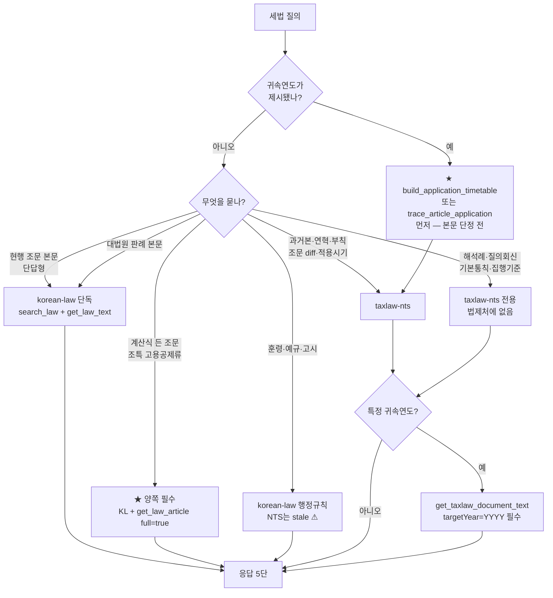
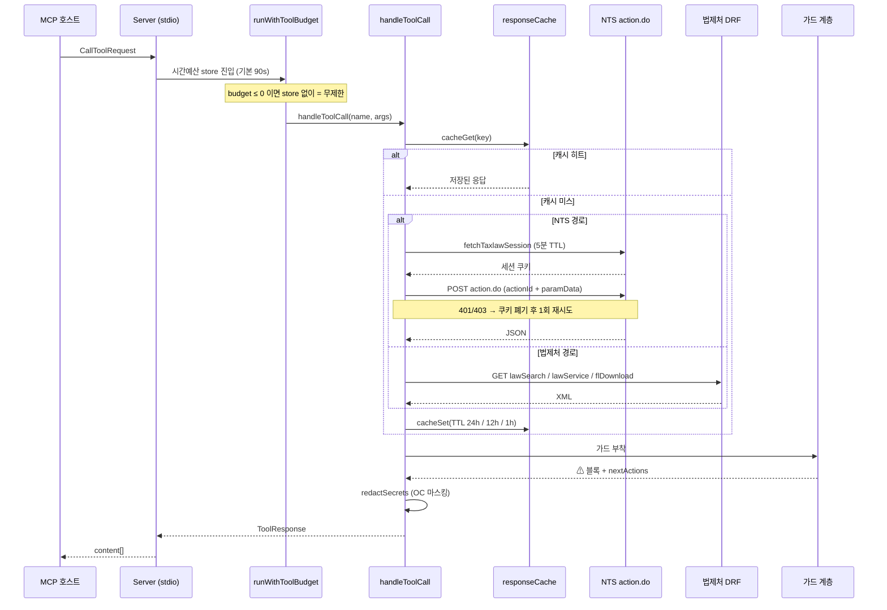

# WORKFLOW — taxlaw-nts-mcp

> **문서 성격** 내부 참조용. **A·B는 에이전트가 따를 절차**, **C는 코드 내부 동작**이다.
> **대상 버전** v0.27.2 · **최종 갱신** 2026-08-07 · **라이브 검증** 2026-08-07
> **관련 문서** [PRD.md](./PRD.md) · [ERD.md](./ERD.md) · [RELEASE.md](./RELEASE.md) · [tools.md](./tools.md)

---

# 파트 A — 질의 응답 워크플로 (에이전트용)

## A.0 대전제

**korean-law-mcp(법제처)와 짝으로 호출한다.** 단, "무조건 둘 다"는 아니다 — 아래 라우팅이 우선한다.

## A.1 1차 라우팅 결정트리



### 라우팅 조건 요약

| 질문 유형 | 1차 | 동반 필요? |
|---|---|---|
| 현행 조문 본문 **단답형** | korean-law | **불필요** — 불필요한 동반 검색 금지 |
| 결론·산출물에 들어가는 인용 | 양쪽 | **필수** |
| **계산식 든 조문** | 양쪽 | **필수** — KL이 수식을 무언 누락 |
| 해석례·기본통칙·집행기준 | taxlaw-nts | 전용 |
| 과거본·연혁·부칙·diff | taxlaw-nts | |
| 대법원 판례 본문 | korean-law | |
| 훈령·예규·고시 | korean-law 행정규칙 | NTS 결과는 stale 대조용 |

## A.2 강제 절차 6개

> 응답 내 `⚠`는 **무시 금지**. hedge로 결론을 대체하지 않는다.

| # | 트리거 | 필수 행동 |
|---|---|---|
| **1** | `get_law_article` 응답의 **"후행 개정 확인"** 블록에 `본문이 변경`/`삭제됨`/`찾지 못함` | 결론 작성 **전** `diff_article_versions(mstA, mstB)` 또는 `get_law_article(mst=현행MST, full=true)` **1콜로 직접 확인**<br/>`공포-미시행` → 미래 귀속 결론 전 그 시행본 확인<br/>`대조 실패` → 제시된 호출 수행 |
| **2** | 특정 귀속연도 질문 | `get_taxlaw_document_text(targetYear=YYYY)` **필수**. 구법조문 기반 예규는 ⚠ 사문화 가능성 경고 동봉 |
| **3** | 해석례 본문 속 `기본통칙 N-N` | **옛 번호일 수 있다** → `list_taxlaw_basic_ruling_laws` → `get_taxlaw_basic_ruling_text`로 **인접 번호대 수집** → 현행 번호 확인.<br/>미확인 시 "현행 번호 미확인" ⚠ / 통칙 도구 NOT_FOUND면 **통칙 인용 제거** |
| **4** | 행정규칙(훈령·예규·고시·지침) 결과 포함 | korean-law `discover_tools(intent="행정규칙")` → `search_admin_rule(knd 1훈령/2예규/3고시)` → `get_admin_rule`.<br/>**공포일·시행일·문서번호 3종 대조** 후 다르면 **법제처 채택** |
| **5** | `NOT_FOUND` | `[RETRY_CANDIDATES]` **L1(쿼리) → L2(도구) → L3(외부 MCP)** 순 재시도.<br/>판례·심판례는 두 MCP 모두 NOT_FOUND여도 **"미존재/할루시네이션" 단정 금지** — 외부 교차확인 전까지 **"공개DB 미발견"까지만** |
| **6** | 산출물(문서·표)에 해석례·심판례·판례 번호 인용 | `verify_nts_citations(text)`로 **일괄 실존 확인** (게이트) |

## A.3 적용시기 — 타임테이블 우선

귀속연도가 제시된 법령·세액공제 질문은 **본문 단정 전** 타임테이블부터.

- 다조문 × 다연도 → `build_application_timetable`
- 단일 조문 → `trace_article_application`

### 해석 공리 6개

1. 신구 문구를 **나란히 대조** — 단일 시점본 단정 금지
2. 부칙 "개정규정" = **그 개정령이 실제 바꾼 문구 단위만**
3. 경과조치는 **자기 개정령만** 사정거리
4. **후행·특정 적용례 > 일반 경과조치**
5. **적극 문언 우선** — fallback 창작 금지
6. **서식·별지 < 부칙·법령 문언**

### ⚠ 공리로 풀리지 않는 경우

적용례 anchor가 **'최초공제연도'·'신고시점'형**이면 **귀속연도만으로 판정 불가**하다.
→ **차수(1차/추가공제)·신고시점을 사용자에게 되물어라.** (조특법 §29의8 통합고용 등 다년 사이클)

## A.4 응답 5단 구조

| 단 | 내용 | 규칙 |
|---|---|---|
| ① | **결론** | 1~2문장 |
| ② | **매트릭스** | 케이스별 **행마다** 결론 + 근거 법령 |
| ③ | **법령 래퍼** | 법률/시행령/기본통칙/해석례·심판례·판례 — 문서번호·일자·인용문, **출처별 분리**<br/>★ 해석례·심판례·판결 **각 건에 NTS 원문 링크 필수** (검색행 `원문:` URL **그대로**, 임의 생성 금지) |
| ④ | **AI 보충** | `⚠ 미검증` — **①~③과 섞기 금지** |
| ⑤ | **"인용 본문 더 부착?"** | 1줄 |

- 빈 섹션도 **헤더는 유지** + "검색 결과 없음" (추측·생성 금지)
- 단답형은 생략 가능
- 두 MCP 동일 사건은 **문서번호(공백·하이픈 제거)·생산일자·제목**으로 병합 + **양쪽 출처 ID 병기**

## A.5 시나리오별 런북

### R1. 현행 조문 본문 — 단답형

```
korean-law search_law → get_law_text(mst/lawId, jo) → 끝
```
동반 호출 불필요. **단, 결론·산출물에 인용으로 들어가면 R2로 승격.**

### R2. 계산식 든 조문 (조특 고용공제류)

```
1. korean-law get_law_text            (문언)
2. taxlaw-nts get_law_article(full=true)  ★ 수식 이미지 URL 확보
3. [수식이미지→flDownload.do?flSeq=N] 마커 → 다운로드 후 Read/브라우저 확인
4. 위임·준용 가드 확인 (B 파트)
```
> korean-law 경로에는 **수식도 위임·준용 신호도 없다.** 2번을 건너뛰면 산식을 모르는 채로 답한다.

### R3. 과거연도 귀속 판정

```
1. build_application_timetable (다조문×다연도)  ← 본문 읽기 전
2. get_law_article(year=YYYY)  시점본 본문
3. "후행 개정 확인" 블록 처리 (강제절차 1)
4. get_law_addenda / trace_article_application  부칙 적용례
5. [부칙개정⚠] 뜨면 → get_law_revision_text(promulgationDate=)  개정문 원문
6. 공리 ①~⑥ 적용
```

### R4. 해석례 · 질의회신

```
1. search_taxlaw_all 또는 search_taxlaw_documents(docType=interpretations)
2. get_taxlaw_document_text(targetYear=YYYY)   ★ 귀속연도 있으면 필수
3. 사문화 채점 결과 확인 → assess_doctrine_validity
4. 본문 속 "기본통칙 N-N" → 강제절차 3
5. 원문 URL 그대로 보존
```

### R5. 판례 · 심판례

```
1. search_taxlaw_documents(docType=disputes)   05~10
2. 대법원 판례 본문은 korean-law가 1차
3. ★ 요지 ≠ 판결결론 — full 전문(주문+판단) 확인. 요지↔결과 모순은 레드플래그
4. 두 MCP NOT_FOUND여도 "공개DB 미발견"까지만
```

### R6. 경정청구 · 의견서 작성 (산출물 산출)

```
1. R2~R5로 근거 수집
2. 인용–명제 단위 검증: verify_nts_citations(text, claims=[{citation, proposition, basis}])
3. basis="direct"(직접근거) / "inference"(추론) 라벨 분리
4. ✗ 결과는 "공개DB 미발견"으로만 기재 — 미존재 단정 금지
5. 원장(jsonl)에 검증 실행 기록됨 → 마감 게이트에서 대조 가능
```

### R7. 업종 판정 (창중감·중특감)

```
1. lookup_upjong_code(code) 또는 search_industry_by_keyword
2. classify_industry_for_article(industryName, upjongCode, excludeNames, excludeLevels)
   → 법조문의 "(수의업 제외)" 류 단서 레벨 판정
3. classify_credit_eligibility(upjong)
4. ⚠ 필수: 결과는 provisional 데이터다. 단서업종(자동차정비공장=종합·소형종합정비업만,
   의료업 요건, 부동산임대·소비성서비스 제외)은 조특법·조특령·조특칙으로 별도 확인
```

## A.6 규범 계층 완주 원칙

**시행령에서 멈추지 마라.** 아래 신호가 있으면 하강한다.

| 신호 | 하강 대상 |
|---|---|
| `…정하여 고시한다` / `고시로 정하는` | **고시(행정규칙)** → korean-law `search_admin_rule(knd=3)` |
| `총리령·부령으로 정한다` | **시행규칙** → `get_law_article(lawName="○○시행규칙")` |
| 운영세부 질문(적용시점·판정단위·계산방법) | 집행기준 · 기본통칙까지 |

> **계층 완주는 에이전트 책임이다.** `buildDelegationGuard`는 **신호만** 준다 — 크로스MCP 맹점이 있어 가드가 침묵해도 하강이 필요할 수 있다.
> **계기** 조특법 §30 고시 §3②2호 누락 → **결론 반전.**
> 단답은 상위에서 종료해도 된다.

---

# 파트 B — 가드 대응 매뉴얼

응답에 붙는 `⚠` 블록별 **다음 액션 결정표**. **이 표의 액션을 수행하지 않고 결론을 쓰면 안 된다.**

## B.1 대응 결정표

| 가드 블록 | 발동 함수 | 신호 | **다음 액션** |
|---|---|---|---|
| `── 후행 개정 확인 ──` | `buildLaterRevisionGuard` | `본문이 변경` | `diff_article_versions(mstA, mstB)` **1콜** |
| | | `삭제됨` | 현행본 확인 — 삭제일 명시 |
| | | `찾지 못함` | `get_law_article(mst=현행MST, full=true)` |
| | | `공포-미시행` | **미래 귀속** 결론 전 그 시행본 확인 |
| | | `대조 실패` | 블록이 제시한 호출 그대로 수행 |
| `── 하위 위임 감지 ⚠ ──` | `buildDelegationGuard` | 고시 위임 | korean-law `discover_tools(intent="행정규칙")` → `search_admin_rule(knd=3)` → `get_admin_rule`<br/>국세청 소관이면 `get_execution_standard` · 기본통칙 병행 |
| | | 시행규칙 위임(실체) | `get_law_article(lawName="○○시행규칙", jo)` |
| | | 시행규칙 위임(**서식**) | 통상 **불필요** (공리⑥). 서식 자체가 쟁점일 때만 |
| `준용 감지` | `extractJunyongTargets` | `lawName` 있음(타법) | 2층 부칙 자동 인라인됨 → **양쪽 부칙 모두** 확인 |
| | | `lawHint` 라벨(비인접) | **귀속 모호** — 자기법으로 처리됨. 원문에서 직접 확인 |
| | | `joRange` 표시 | **대표 조만 추적됨** — 나머지 조는 `build_application_timetable`로 별도 |
| `── 해석 분기 가드(사후관리) ──` | `buildInterpretiveForkGuard` | 4-AND 게이트 | ① 해석례로 산식 확정 ② 추징식 정합성 교차검증 ③ 숫자 예시 스트레스테스트 (아래 B.2) |
| `── 해석 분기 가드(폐쇄 호구분형) ──` | 동일 | 폐쇄 열거형 | **다른 조문의 단가전환 법리를 준용하지 마라.** 시점본(법률 번호) 명기 |
| 행정규칙 stale | `ADMIN_RULE_STALE_NOTICE` | 훈령·예규·고시·지침 포함 | **공포일·시행일·문서번호 3종 대조** → 다르면 법제처 채택 |
| 사문화 채점 | `assessDoctrineValidity` | `repealed_or_superseded` | 인용 **제거** 또는 구법 명시 |
| | | `partially_outdated` | 변경된 부분 특정 |
| | | `citations_no_dates` | 시점 단서 없음 — korean-law로 현행 조문 직접 대조 |
| 구조개편 검출 | `detectPreRestructureCitations` | 옛 조번호 | 현행 위치로 **정정 표기** (자동 격상됨) |
| `[부칙개정⚠]` | `checkAmendmentBinding` | `개정함` | `get_law_revision_text(promulgationDate=)` 개정문 원문 대조 |
| | | `개정 흔적 없음` | 그 개정령은 이 조문을 안 건드림 |
| | | `판정불가` | 인벤토리 부족 — 수동 확인 |
| `[RETRY_CANDIDATES]` | `buildRetryQueries` | NOT_FOUND | **L1 쿼리 → L2 도구 → L3 외부 MCP** 순 |
| `[BUDGET_EXCEEDED]` | `runWithToolBudget` | 90s 초과 | **부분 결과는 유효.** 범위 좁혀 재호출 |
| 본문 절단 | v0.26.1 O2-2 | 6k/16k 초과 | **후미 항·호·계산식 소실 가능** → 능동 재조회 |
| `FAILURE_GUARD` | `formatToolError` | 예외 계열 실패(파라미터·API·파싱) | **추측·생성 금지.** 실패 사실을 사용자에게 명시 |
| `⚠ 데이터 없음` | `notFoundResponse` | 검색 0건(NOT_FOUND) | 전용 짧은 가드 + `[RETRY_CANDIDATES]` L1→L2→L3 |

## B.2 해석 분기 가드 — 3단 대응 상세

가장 위험한 가드다. 문언만 읽고 산식을 단정하면 틀린다.

```
① 해석례 확정
   search_taxlaw_all / search_taxlaw_documents로
   "해당 호 미적용 시 잔여연도 공제 산식"을 직접 확인
   → 온포인트 해석이 없으면 "해석 미확인"으로 hedge
   → ★ literal로 메우지 마라 (검색 실패 ≠ 해석 부재)

② 추징식 정합성 교차검증
   forward 공제식  vs  추징 산식(시행령: 감소인원 × (상위호 − 하위호))
   추징이 '프리미엄만 환수'하면 forward도 하위 호 단가는 유지되는 것이 정합
   → 두 식이 충돌하면 레드플래그

③ 숫자 예시 스트레스테스트
   "전체 유지인데 공제가 줄면 말이 되나?" 1줄 점검
```

**실측 근거** 조특법 §29의7② "청년 감소 → 제1항제1호 미적용"을 "제2호 = 원래 청년외 증가분만"으로 오독 → **정답은 전체 증가인원 전부 제2호 단가** (기재부 조특제도과-215 · 서면-2023-법인-0978).

**역방향 오류도 경계** 폐쇄 호구분형 조문에는 이 전환 법리를 **유추 적용하지 마라** (해석례 부재 시 문언 우선). 실측: 구 조특법 §30의4② 2호 — 청년등 감소 시 제1항제2호 상당액만.

## B.3 가드 신호의 구조적 맹점 ⚠

| 맹점 | 내용 | 대응 |
|---|---|---|
| **korean-law 경로엔 가드가 없다** | 조문을 `get_law_text`로 읽으면 위임·준용·수식 신호가 **전혀 없다** | 위임·준용 판정이 필요하면 `get_law_article` **1콜 병행** |
| **크로스MCP 맹점** | `buildDelegationGuard`는 자기 응답만 본다 | 계층 완주는 **에이전트 책임** |
| **가드는 advisory** | 정규식 휴리스틱이라 false negative 존재 | 가드 침묵 ≠ 안전 |
| **`대통령령`은 경고 안 함** | 과발동 방지로 의도적 제외 | 시행령 확인은 **기본 동작**으로 항상 수행 |

---

# 파트 C — 내부 처리 파이프라인

## C.1 요청 1건의 전체 경로



## C.2 계층별 상세

### C.2.1 진입 — 시간예산

```
CallToolRequestSchema handler
  └─ runWithToolBudget(() => handleToolCall(name, args))
```

- 진입점을 **핸들러에 둔 이유** — `handleToolCall` 직접 호출(테스트)은 store 부재 = 무제한을 유지하기 위해
- MCP 콜 1건 전체를 **하나의** 예산으로 감싼다 — **재귀 `call_taxlaw_extra` 포함**
- `AsyncLocalStorage<ToolBudget>` — `{ deadlineAt, budgetMs }`

### C.2.2 캐시 관문

```
postTaxlawAction(actionId, paramData, refererPath)
  ├─ cacheKey = `nts:${actionId}:${JSON.stringify(paramData)}`
  ├─ cacheGet → 히트면 JSON.parse 후 즉시 반환
  ├─ postTaxlawActionAttempt(..., allowRefresh=true)
  └─ cacheSet(TTL: NTS_DETAIL_ACTION_IDS.has(actionId) ? 12h : 1h)
       └─ 직렬화 불가 응답은 캐시 생략 (try/catch)
```

- **성공 응답만** 캐시 — 쿠키 갱신·재시도 경로와 충돌 없음
- LRU 갱신 = `delete` 후 `set` 재삽입
- 축출 루프: `size > 200 || totalChars > 64M` 동안 가장 오래된 것부터

### C.2.3 NTS 세션

```
fetchTaxlawSession(refererPath, force?)
  ├─ cachedSession && now - fetchedAt < 5분  → 재사용
  ├─ getSetCookieHeaders(headers)
  │    ├─ Headers.getSetCookie() 우선
  │    └─ 미지원 런타임 → 단일 set-cookie fallback
  └─ 쿠키 미반환 → TaxlawMcpError(API_ERROR)
```

**POST 요청 형태**
```
POST https://taxlaw.nts.go.kr/action.do
content-type: application/x-www-form-urlencoded
origin/referer: TAXLAW_BASE + refererPath   ← referer가 틀리면 거부됨
body: actionId=...&paramData={...}
```

**401/403 처리** `cachedSession = null` 후 **1회만** 재시도 (`allowRefresh=false`로 재귀 — 무한 루프 차단).

### C.2.4 재시도 · 백오프 (`fetchWithRetry`)

```
retries = 3 (총 4회 시도)

매 시도 전:
  remaining ≤ 0  →  [BUDGET_EXCEEDED] 즉시 throw

개별 fetch 타임아웃 = min(15,000ms, 남은예산)     ← 마지막 왕복이 예산을 넘겨 늘어지지 않게
재시도 대상 status = 429 / 503 / 504만
백오프 = 700 × 2^attempt  (700 → 1,400 → 2,800ms)
  단, 남은예산 ≤ 백오프  →  대기 없이 중단
```

> **설계 의도** 대기 후 다시 예산 소진을 확인하는 낭비를 제거. 예산은 **사전 게이트**로 쓴다.

### C.2.5 병렬 처리

| 위치 | 동시성 | 방식 |
|---|---|---|
| 다중 컬렉션 검색 | `mapWithConcurrency` | 워커 풀 (index 선점) |
| 인용 검증 | `CONCURRENCY = 4` | 청크 분할 |
| `get_law_article` (mst + lawName 동시) | 2 | 버전목록 fetch를 `await` 않고 promise만 만들어 조문 XML fetch와 `Promise.all` — **직렬 1왕복 제거** |

### C.2.6 법제처 DRF 경로

| 엔드포인트 | 용도 |
|---|---|
| `lawSearch.do?target=law` | 현행 MST 해소 |
| `lawSearch.do?target=eflaw&display=40` | 시점본 목록 |
| `lawService.do?target=law&MST=&type=XML` | 법령 XML 전문 |
| `flDownload.do?flSeq=N` | **수식 이미지** |

**XML 파싱 주의** `<부칙내용>`은 여러 `<![CDATA[...]]>` 조각으로 나뉘어 있다 → `extractCdataText`가 **선형 스캔**으로 병합 (v0.26.0 SEC-4b에서 O(n²) ReDoS 제거).

**eflaw 필터링 ⚠** `lawSearch(query=법령명)`는 이름이 **'포함'된 타법**(시행령·시행규칙 등)까지 반환한다.
- self-law → `filterVersionsByName` (폴백 있음)
- **타법(cross-law) → `filterVersionsByNameStrict`** — 정확 제명 일치만, **0건이면 안전 강등** (폴백 채택 = 오해소이므로)

### C.2.7 준용 타법 해소 (`resolveCrossLawCtx`) — 5종 비타협 가드

```
① filterVersionsByNameStrict     정확 제명 일치만 (0건 = 안전 강등)
② 상한 2개 타법                   makeCrossResolver 요청당 memo + cap
③ prepareMergedAddenda(depth=2)  mst 명시 전달 → resolveLawMst 첫행채택 원천차단
④ 15s 시간예산 사전게이트
⑤ 실패 시 E2 라벨 + 사유 강등     오귀속 인벤토리 생산 금지, 재귀 금지
```
+ 사후검증: `lawService` 응답 **제명 재검증** — 빈값·불일치·이상이면 안전 강등 (v0.25.0 A8)

### C.2.8 출력 계층

```
가드 부착  →  토큰 상한 적용  →  redactSecrets  →  ToolResponse
```

| 상한 | 기본 | full=true | 초과 시 |
|---|---:|---:|---|
| 조문 본문 | 6,000자 | 16,000자 | 생략 라벨 + **능동 재조회 안내** |
| 준용 체인 | 8,000자 | 24,000자 | `capJunyongBlocks` 생략 라벨 |

> **cap을 올리지 않는 이유** 토큰이 1급 제약이다. 절단 사실을 **알리는 것**이 늘리는 것보다 안전하다.

### C.2.9 stdio 오염 방지

```js
console.log = console.warn = console.info = console.debug = stderrWrite
```

**stdout은 MCP 프로토콜 전용이다.** 라이브러리가 `console.log`를 호출하면 프로토콜이 깨지므로 전부 stderr로 리다이렉트한다.

## C.3 실패 경로 요약

| 실패 지점 | 코드 | 동작 |
|---|---|---|
| OC 미설정 | `INVALID_PARAMETER` | 즉시 실패 — 환경변수 안내 |
| 세션 쿠키 미반환 | `EXTERNAL_API_ERROR` | 즉시 실패 |
| 401/403 | — | 쿠키 폐기 후 **1회** 재시도 |
| 429/503/504 | — | 지수 백오프 최대 3회 |
| 예산 소진 | `EXTERNAL_API_ERROR` | `[BUDGET_EXCEEDED]` — **부분 결과 유효** 명시 |
| JSON/XML 파싱 실패 | `PARSE_ERROR` | |
| 검색 0건 | `NOT_FOUND` | `[RETRY_CANDIDATES]` 3단계 부착 |
| 원장 기록 실패 | — | **무시** (가용성 우선) |
| 준용 타법 해소 실패 | — | **E2 라벨로 강등** (오귀속 생산 금지) |

**실패 유형별 가드 2종**(라이브 확인 2026-08-07)
- 예외 계열(`INVALID_PARAMETER`·`EXTERNAL_API_ERROR`·`PARSE_ERROR`) → `formatToolError`가 `FAILURE_GUARD` 전문 부착:
  "LLM은 세법 정보, 문서, 판례를 추측하거나 생성하지 말고 오류/검색 실패와 재시도 필요성을 사용자에게 명시하세요."
- 검색 0건(`NOT_FOUND`) → `notFoundResponse`가 전용 짧은 가드: **"⚠ 데이터 없음 — LLM은 결과 추측·생성 금지."** + `[RETRY_CANDIDATES]`

두 경로 모두 `textResponse` → `redactSecrets`를 거친다.
